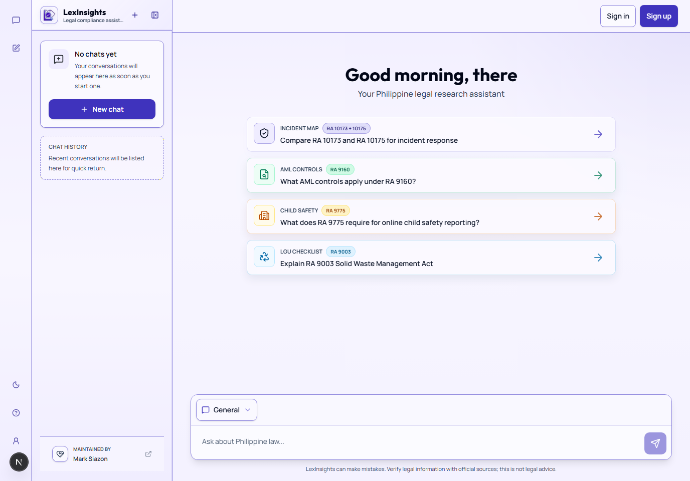
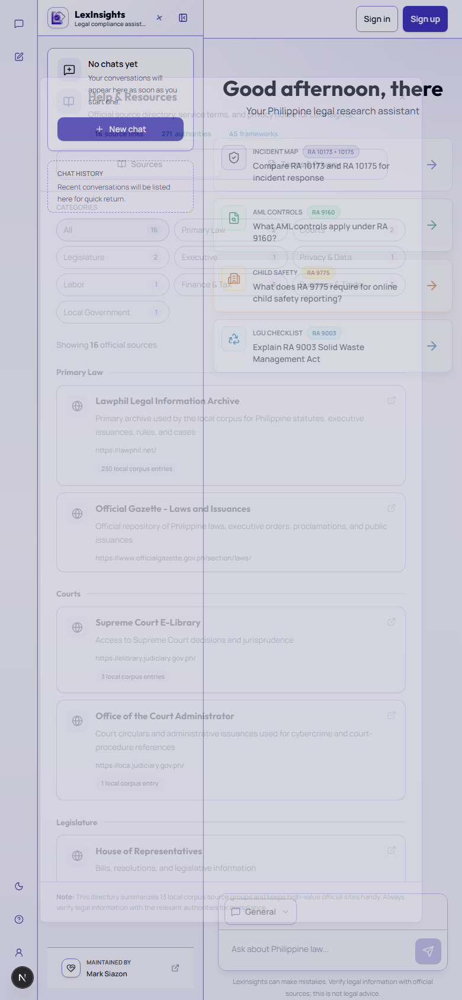

# LexInsights

LexInsights is a Philippine legal research and compliance assistant for legal chat, document review, local providerless RAG research, citation discovery, and compliance-oriented reports.

- Live app: [lexiph.vercel.app](https://lexiph.vercel.app)
- Project profile: [About LexInsights](https://lexiph.vercel.app/about)
- Terms: [lexiph.vercel.app/terms](https://lexiph.vercel.app/terms)
- Privacy: [lexiph.vercel.app/privacy](https://lexiph.vercel.app/privacy)
- Maintainer portfolio: [marksiazon.dev](https://www.marksiazon.dev)
- Legacy showcase reference: [lexinsights.vercel.app](https://lexinsights.vercel.app)

LexInsights is not a lawyer, law firm, court, regulator, or official government source. Generated output should be checked against official sources, qualified counsel, or the relevant authority before use.

## Product Preview





## Project Trust

- Security policy: [SECURITY.md](SECURITY.md)
- Changelog: [CHANGELOG.md](CHANGELOG.md)
- License posture: [LICENSE](LICENSE)
- Public source and legal directory: available inside Help & Resources in the app.

## What It Does

- Answers Philippine legal and compliance research questions through a chat-first interface.
- Reviews text, Markdown, PDF, Word, and legacy DOC content for compliance issues.
- Uses a bundled local corpus for providerless legal research when external AI/RAG providers are unavailable or disabled.
- Detects citations, source support, confidence signals, and practical compliance checklist items.
- Provides public source, terms, privacy, attribution, PWA, and answer-engine discovery surfaces.

## Current Public Surfaces

- `/` and `/chat` open the usable assistant experience.
- `/about` connects the app, repository, maintainer portfolio, case study, and legacy showcase reference.
- `/terms` and `/privacy` provide public service and data-handling notices.
- `/robots.txt`, `/sitemap.xml`, `/llms.txt`, and `/ai.txt` support search, answer-engine, and crawler discovery.
- `/api/version` and `/api/readiness` support lean deployment and health verification without exposing secrets, raw targets, or repository ownership details.

## Production Readiness

- CI runs lint, typecheck, production dependency audit, docs checks, release checks, PWA checks, screenshot validation, production bundle checks, build, and browser smoke tests.
- Local providerless RAG is covered by golden-query, answer-quality, source-freshness, performance, governance, and optional live-source audits.
- `/terms` and `/privacy` are public production notices for service use, data handling, retention, security, and Philippine privacy rights.
- Help & Resources keeps official source links close to the assistant so generated answers can be checked against primary authorities.
- Production deployments are verified against `/api/version` and `/api/readiness` so `lexiph.vercel.app` can be matched to the intended commit.

## Local Development

```powershell
npm install
npm run dev
```

Open `http://localhost:3000`.

Copy `.env.example` to `.env.local` and fill provider values as needed. Providerless local research is the default mode.

## Verification

Use the same core gates as CI:

```powershell
npm run lint -- --max-warnings=0
npx tsc --noEmit
npm audit --omit=dev
npm run check:docs
npm run check:pwa
npm run check:release
npm run build
npm run smoke:browser
```

For the full local release gate:

```powershell
npm run check:local
```

For production:

```powershell
npm run check:deployment -- --base-url https://lexiph.vercel.app
npm run check:live -- --base-url https://lexiph.vercel.app
```

## Documentation

The documentation root is [docs/README.md](docs/README.md). Start there for setup, architecture, API behavior, UI rules, SEO/AEO/GEO notes, testing, deployment, and ship-readiness guidance.
