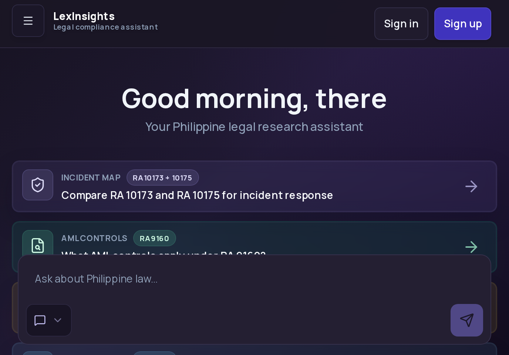
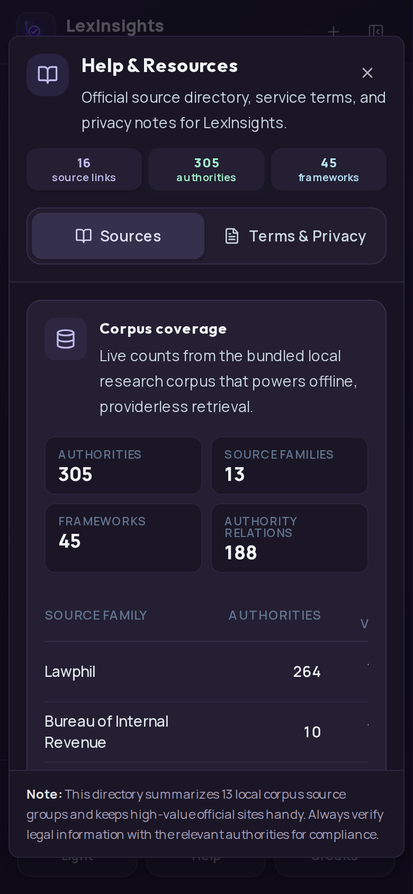
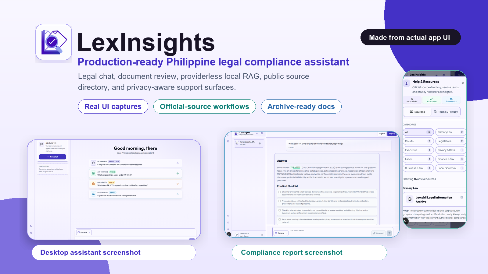

# LexInsights

LexInsights is a Philippine legal research and compliance assistant for legal chat, document review, local providerless RAG research, citation discovery, and compliance-oriented reports.

- Live app: [lexiph.vercel.app](https://lexiph.vercel.app)
- Project profile: [About LexInsights](https://lexiph.vercel.app/about)
- Terms: [lexiph.vercel.app/terms](https://lexiph.vercel.app/terms)
- Privacy: [lexiph.vercel.app/privacy](https://lexiph.vercel.app/privacy)
- Maintainer portfolio: [marksiazon.dev](https://www.marksiazon.dev)
- Legacy showcase reference: [lexinsights.vercel.app](https://lexinsights.vercel.app)

LexInsights is not a lawyer, law firm, court, regulator, or official government source. Generated output should be checked against official sources, qualified counsel, or the relevant authority before use.

## Product Preview

Preview captures are kept as the README smoke-check pair.





## Visual Archive



Feature-by-feature screenshots, viewport coverage, light and dark theme captures, showcase mockups, and all repository visual assets (social previews, light-mode captures, the providerless RAG flow diagram, PWA screenshots) are documented in [docs/SCREENSHOTS.md](docs/SCREENSHOTS.md).

## Project Trust

- Security policy: [SECURITY.md](SECURITY.md)
- Changelog: [CHANGELOG.md](CHANGELOG.md)
- License posture: [LICENSE](LICENSE)
- Public source and legal directory: available inside Help & Resources in the app.

## What It Does

- Answers Philippine legal and compliance research questions through a chat-first interface.
- Reviews text, Markdown, PDF, Word, and legacy DOC content for compliance issues.
- Uses a bundled local corpus for providerless legal research when external AI/RAG providers are unavailable or disabled.
- Detects citations, source support, confidence signals, and practical compliance checklist items.
- Exports compliance reports as Markdown, Word, or PDF, each with the A.M. No. 25-11-28-SC AI-use disclosure appended.
- Signs users in with Clerk (Supabase third-party auth is live in production); signed-in users' compliance reports sync to Supabase and survive clearing browser storage, while guests stay local-only.
- Provides public source, terms, privacy, attribution, PWA, and answer-engine discovery surfaces.

## Reviewer Walkthrough

1. Open [lexiph.vercel.app](https://lexiph.vercel.app) and start from the chat prompt cards.
2. Ask a Philippine legal question that includes a statute or compliance scenario.
3. Switch into compliance mode and inspect the generated report, citations, research metadata, and export controls (sign in first to keep report history in the cloud).
4. Open Help & Resources to review the primary-source directory used for verification.
5. Check `/about`, `/terms`, and `/privacy` for public context, legal notices, and data-handling posture.
6. Review the [screenshot catalog](docs/SCREENSHOTS.md) for captured desktop, tablet, mobile, light theme, dark theme, and small-phone states.

## Current Public Surfaces

- `/` and `/chat` open the usable assistant experience.
- `/about` connects the app, repository, maintainer portfolio, case study, and legacy showcase reference.
- `/terms` and `/privacy` provide public service and data-handling notices.
- `/robots.txt`, `/sitemap.xml`, `/llms.txt`, and `/ai.txt` support search, answer-engine, and crawler discovery.
- `/api/version` and `/api/readiness` support lean deployment and health verification without exposing secrets, raw targets, or repository ownership details.

## Local Development

```bash
npm install
npm run dev
```

Open `http://localhost:3000`.

Copy `.env.example` to `.env.local` and fill provider values as needed. Providerless local research is the default mode.

## Verification

CI (`.github/workflows/ci.yml`) runs lint, typecheck, unit tests, production dependency audit, docs/release/PWA/screenshot checks, local RAG QA (golden-query, answer-quality, source-freshness, performance, governance), build, production bundle checks, and browser smoke tests on every push and pull request to `main`. See [docs/operations/TESTING.md](docs/operations/TESTING.md) for the full matrix.

Use the same core gates as CI:

```bash
npm run lint -- --max-warnings=0
npx tsc --noEmit
npm run test
npm audit --omit=dev
npm run check:docs
npm run check:pwa
npm run check:release
npm run build
npm run smoke:browser
```

For the full local release gate:

```bash
npm run check:local
```

For production:

```bash
npm run check:deployment -- --base-url https://lexiph.vercel.app
npm run check:live -- --base-url https://lexiph.vercel.app
```

Production deployments are verified against `/api/version` and `/api/readiness` so `lexiph.vercel.app` can be matched to the intended commit.

## Documentation

The documentation root is [docs/README.md](docs/README.md). Start there for setup, architecture, API behavior, UI rules, SEO/AEO/GEO notes, testing, deployment, and ship-readiness guidance.
