# LexInsights Screenshot Catalog

This catalog documents the organized screenshot archive under `public/screenshots` and the composed mockup boards under `public/mock-ups`. The captures are grouped by feature area so reviewers can inspect the app by workflow, viewport, and theme.

## Capture Index

- [A1 - Chat Home](#a1---chat-home)
- [A2 - Chat Compliance Mode](#a2---chat-compliance-mode)
- [A3 - Chat History Sidebar](#a3---chat-history-sidebar)
- [A4 - Mobile Navigation](#a4---mobile-navigation)
- [A5 - Help Resources](#a5---help-resources)
- [A6 - Auth Sign In](#a6---auth-sign-in)
- [A7 - Authors Attribution](#a7---authors-attribution)
- [A8 - About Page](#a8---about-page)
- [A9 - Terms Page](#a9---terms-page)
- [A10 - Privacy Page](#a10---privacy-page)
- [A11 - Offline Page](#a11---offline-page)
- [A12 - Compliance Report](#a12---compliance-report)
- [Mockup Boards](#mockup-boards)

## A1 - Chat Home

The chat home captures prove the first-run research surface: prompt cards, legal assistant framing, composer layout, and responsive behavior across desktop, tablet, and mobile in both themes.

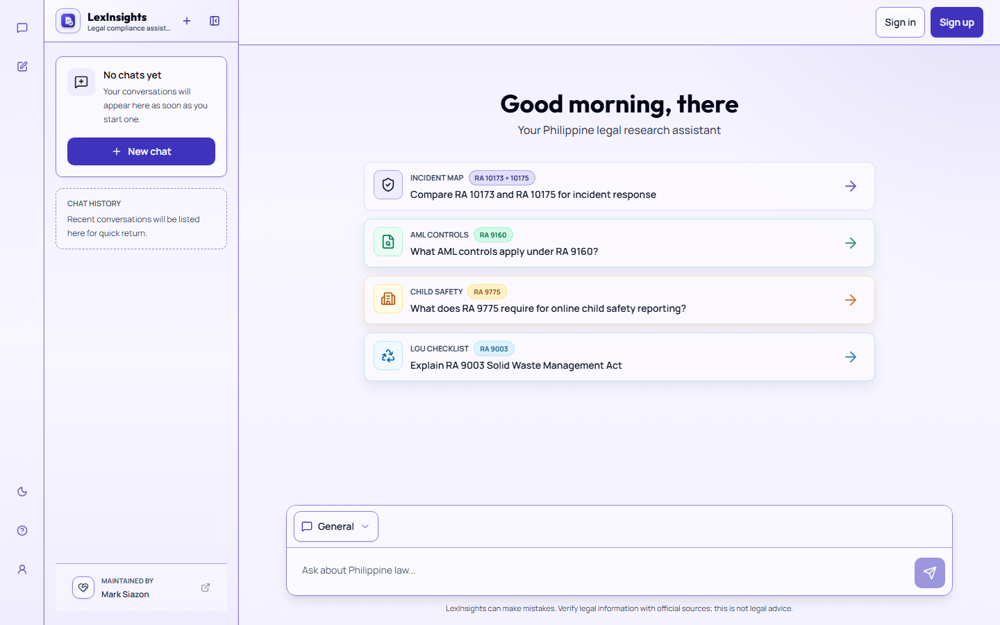

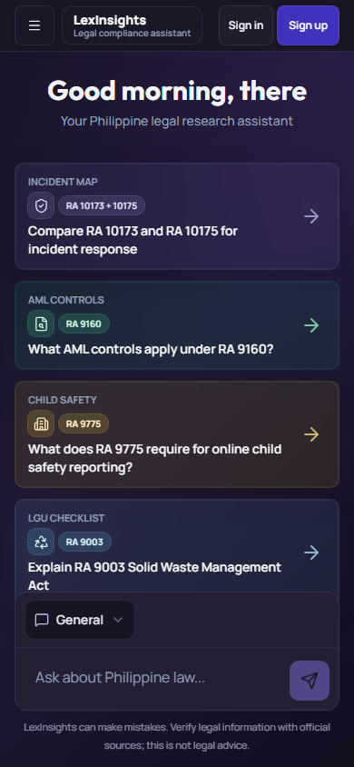

Available captures: [desktop dark](../public/screenshots/A1-Chat-Home/desktop-dark.png), [desktop light](../public/screenshots/A1-Chat-Home/desktop-light.png), [tablet dark](../public/screenshots/A1-Chat-Home/tablet-dark.png), [tablet light](../public/screenshots/A1-Chat-Home/tablet-light.png), [mobile dark](../public/screenshots/A1-Chat-Home/mobile-dark.png), [mobile light](../public/screenshots/A1-Chat-Home/mobile-light.png).

## A2 - Chat Compliance Mode

Compliance mode captures show the assistant configured for compliance-oriented research. They document the mode control, prompt content, and how the same workflow adapts between full-width desktop and narrow mobile layouts.

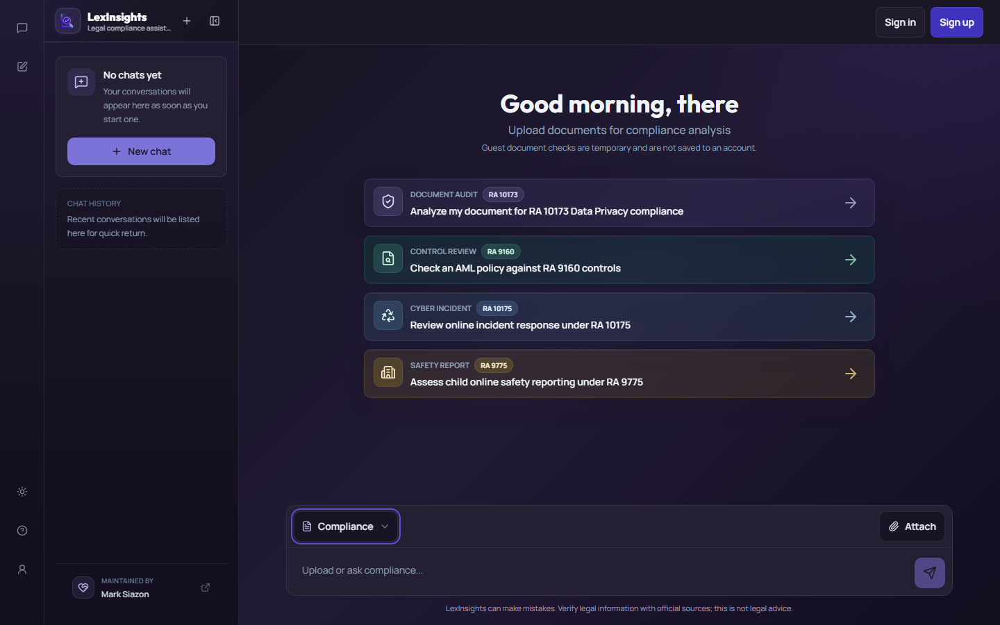

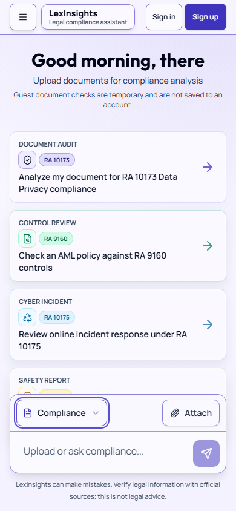

Available captures: [desktop dark](../public/screenshots/A2-Chat-Compliance-Mode/desktop-dark.png), [desktop light](../public/screenshots/A2-Chat-Compliance-Mode/desktop-light.png), [mobile dark](../public/screenshots/A2-Chat-Compliance-Mode/mobile-dark.png), [mobile light](../public/screenshots/A2-Chat-Compliance-Mode/mobile-light.png).

## A3 - Chat History Sidebar

The sidebar captures prove the expanded chat-history state, maintained-by area, and app controls after the compact mobile sidebar fixes. The component-level views make the sidebar readable without relying on a full-page crop.

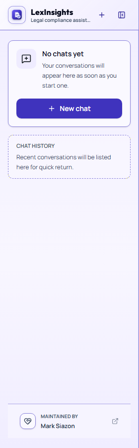

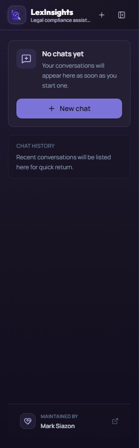

Available captures: [component dark](../public/screenshots/A3-Chat-History-Sidebar/component-dark.png), [component light](../public/screenshots/A3-Chat-History-Sidebar/component-light.png).

## A4 - Mobile Navigation

Mobile navigation captures document the smallest-screen top bar and drawer behavior, including the compact authentication action treatment and touch-friendly navigation controls.

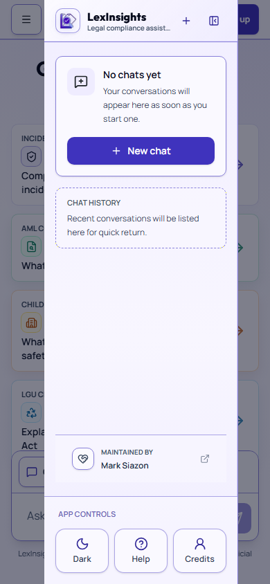

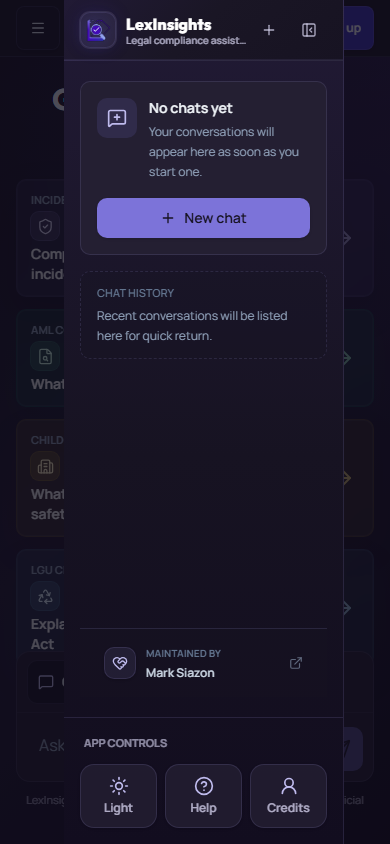

Available captures: [mobile dark](../public/screenshots/A4-Mobile-Navigation/mobile-dark.png), [mobile light](../public/screenshots/A4-Mobile-Navigation/mobile-light.png).

## A5 - Help Resources

Help & Resources captures show the official-source directory, verification-oriented support copy, and responsive resource browsing. This is the reviewer path for checking that generated legal information is paired with primary-source references.

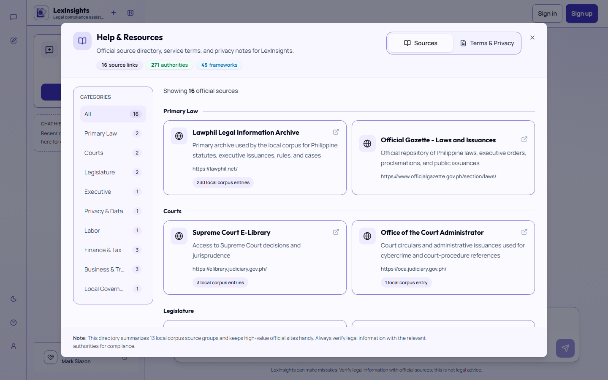

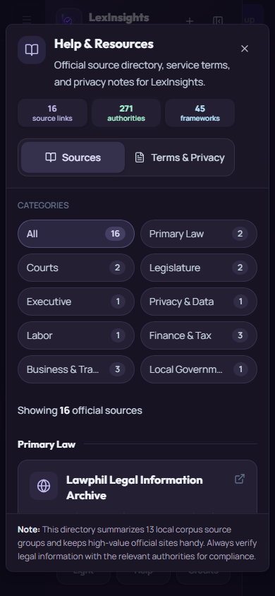

Available captures: [desktop dark](../public/screenshots/A5-Help-Resources/desktop-dark.png), [desktop light](../public/screenshots/A5-Help-Resources/desktop-light.png), [mobile dark](../public/screenshots/A5-Help-Resources/mobile-dark.png), [mobile light](../public/screenshots/A5-Help-Resources/mobile-light.png).

## A6 - Auth Sign In

The sign-in captures cover the public authentication entry point in desktop and mobile contexts. They document visual consistency, form hierarchy, and theme support without requiring a reviewer to sign in.

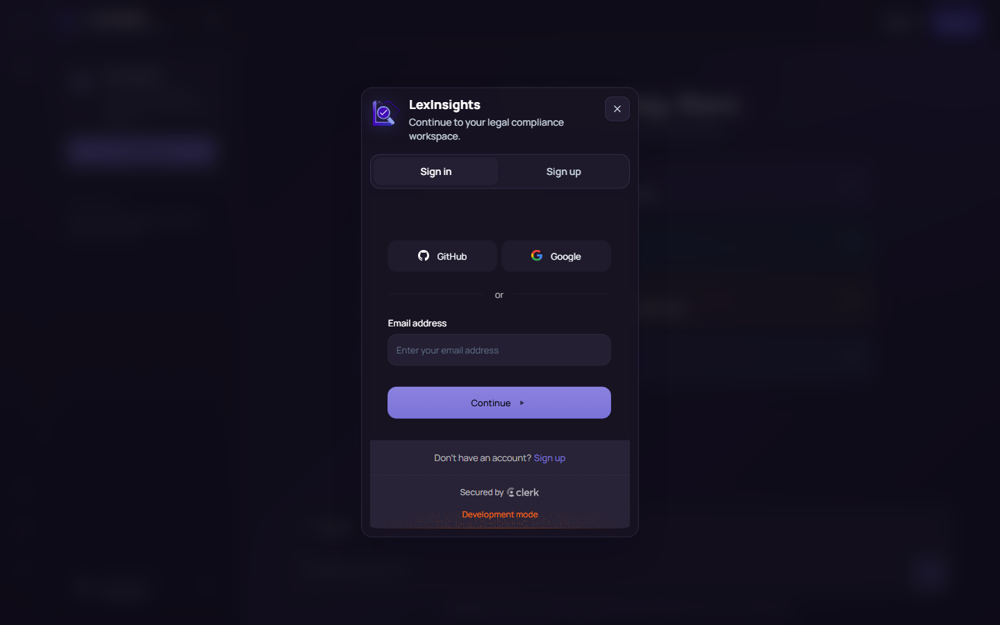

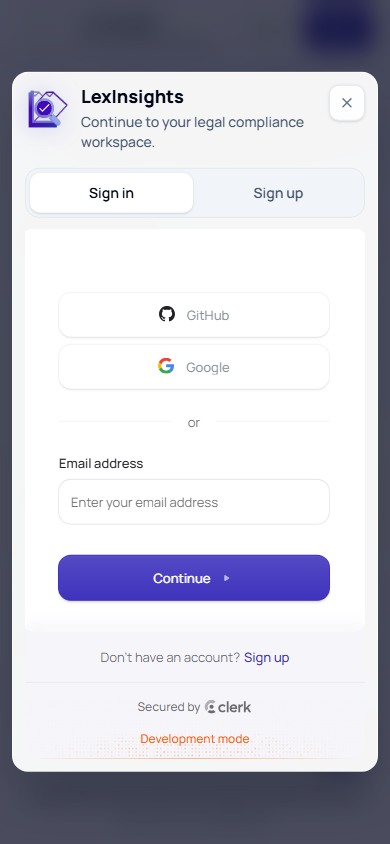

Available captures: [desktop dark](../public/screenshots/A6-Auth-Sign-In/desktop-dark.png), [desktop light](../public/screenshots/A6-Auth-Sign-In/desktop-light.png), [mobile dark](../public/screenshots/A6-Auth-Sign-In/mobile-dark.png), [mobile light](../public/screenshots/A6-Auth-Sign-In/mobile-light.png).

## A7 - Authors Attribution

Author attribution captures document the maintainer and project-credit component. This supports provenance review and keeps the archive clear about who maintains the public project surface.

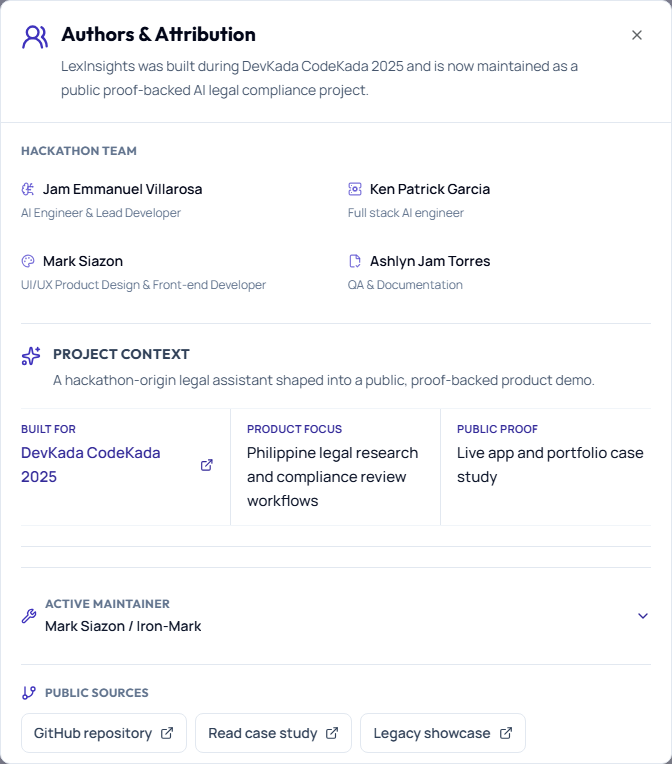

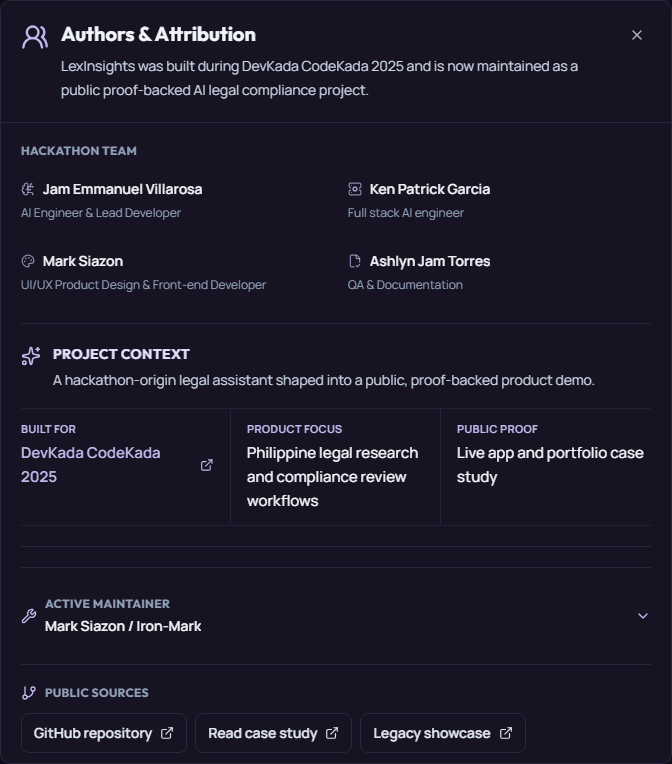

Available captures: [component dark](../public/screenshots/A7-Authors-Attribution/component-dark.png), [component light](../public/screenshots/A7-Authors-Attribution/component-light.png).

## A8 - About Page

The About page captures show the project profile, maintainer links, repository context, and public explanation of the app. Desktop, tablet, and mobile states are included for both themes.

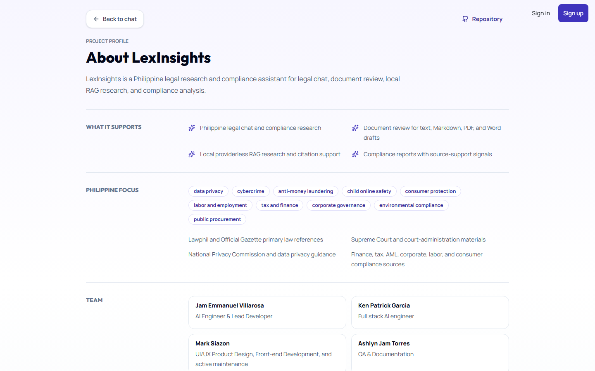

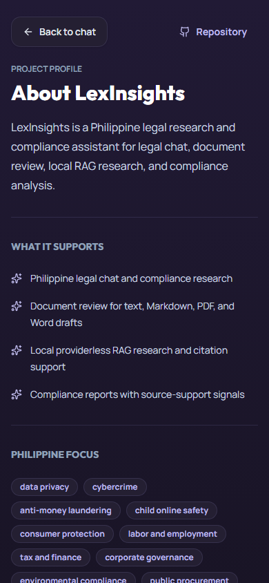

Available captures: [desktop dark](../public/screenshots/A8-About-Page/desktop-dark.png), [desktop light](../public/screenshots/A8-About-Page/desktop-light.png), [tablet dark](../public/screenshots/A8-About-Page/tablet-dark.png), [tablet light](../public/screenshots/A8-About-Page/tablet-light.png), [mobile dark](../public/screenshots/A8-About-Page/mobile-dark.png), [mobile light](../public/screenshots/A8-About-Page/mobile-light.png).

## A9 - Terms Page

Terms captures document the public service notice, legal-use framing, and responsive layout for the terms surface. These images help reviewers confirm that the app does not present generated output as official legal advice.

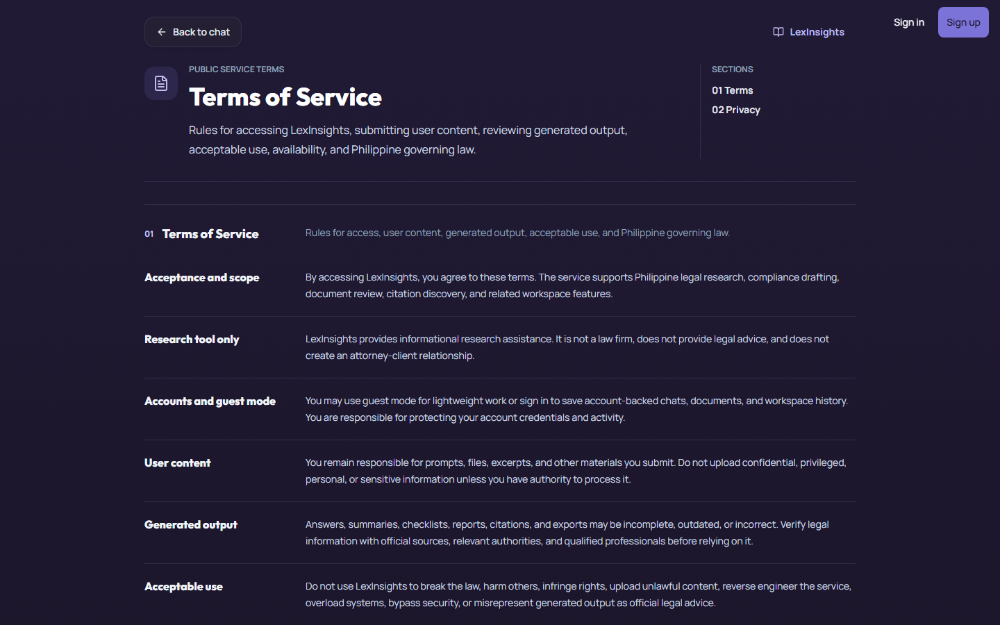

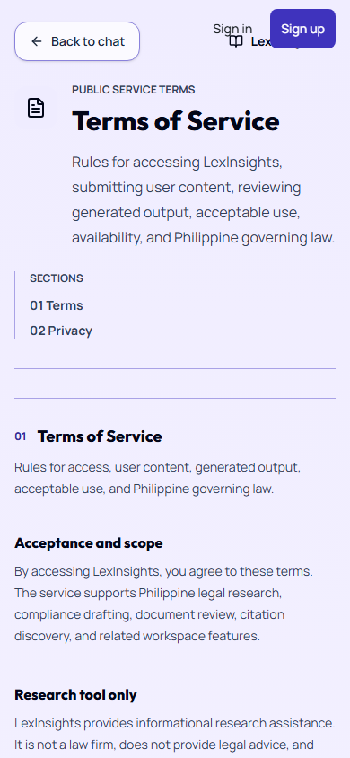

Available captures: [desktop dark](../public/screenshots/A9-Terms-Page/desktop-dark.png), [desktop light](../public/screenshots/A9-Terms-Page/desktop-light.png), [tablet dark](../public/screenshots/A9-Terms-Page/tablet-dark.png), [tablet light](../public/screenshots/A9-Terms-Page/tablet-light.png), [mobile dark](../public/screenshots/A9-Terms-Page/mobile-dark.png), [mobile light](../public/screenshots/A9-Terms-Page/mobile-light.png).

## A10 - Privacy Page

Privacy captures show the public data-handling surface, including responsive layout and theme coverage. This gives reviewers a direct visual checkpoint for trust and privacy communication.

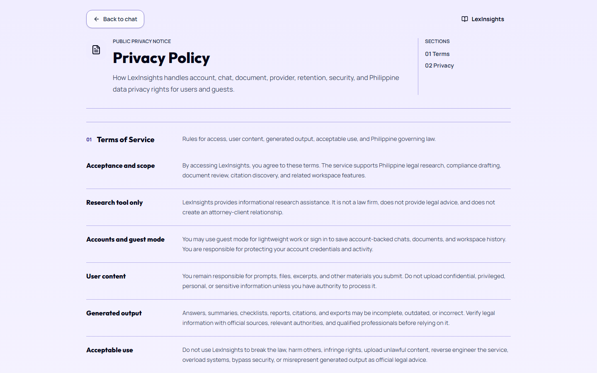

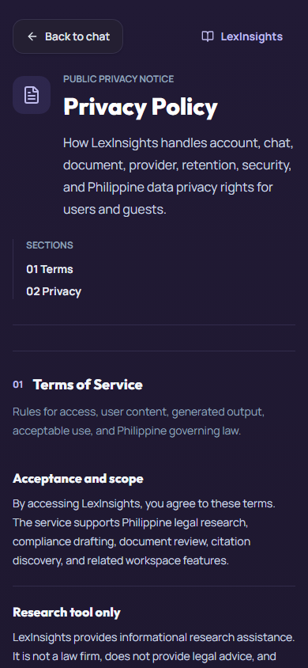

Available captures: [desktop dark](../public/screenshots/A10-Privacy-Page/desktop-dark.png), [desktop light](../public/screenshots/A10-Privacy-Page/desktop-light.png), [tablet dark](../public/screenshots/A10-Privacy-Page/tablet-dark.png), [tablet light](../public/screenshots/A10-Privacy-Page/tablet-light.png), [mobile dark](../public/screenshots/A10-Privacy-Page/mobile-dark.png), [mobile light](../public/screenshots/A10-Privacy-Page/mobile-light.png).

## A11 - Offline Page

Offline captures document the PWA fallback surface. They prove that the app has a clear offline state on desktop and mobile, in light and dark themes.

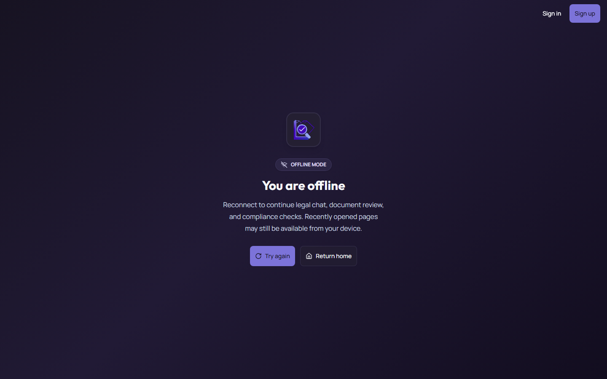

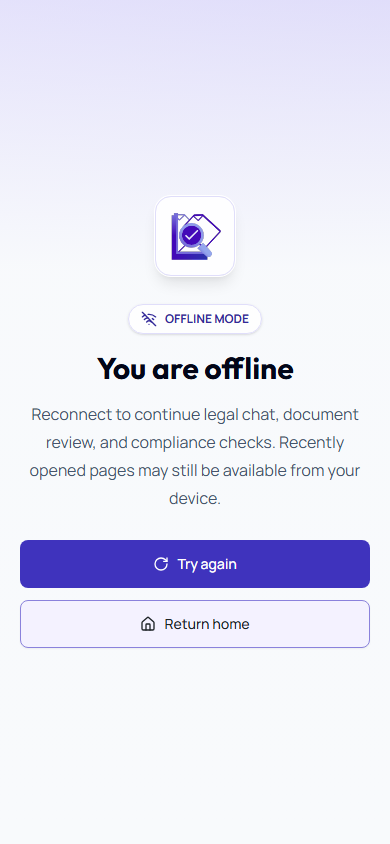

Available captures: [desktop dark](../public/screenshots/A11-Offline-Page/desktop-dark.png), [desktop light](../public/screenshots/A11-Offline-Page/desktop-light.png), [mobile dark](../public/screenshots/A11-Offline-Page/mobile-dark.png), [mobile light](../public/screenshots/A11-Offline-Page/mobile-light.png).

## A12 - Compliance Report

Compliance report captures document the generated report workflow: research metadata, source matches, generated legal-analysis warning, citations, export controls, and compact mobile header behavior. The small-phone scrolled states are included because this page is intentionally long and needs to remain usable while reviewing dense content.

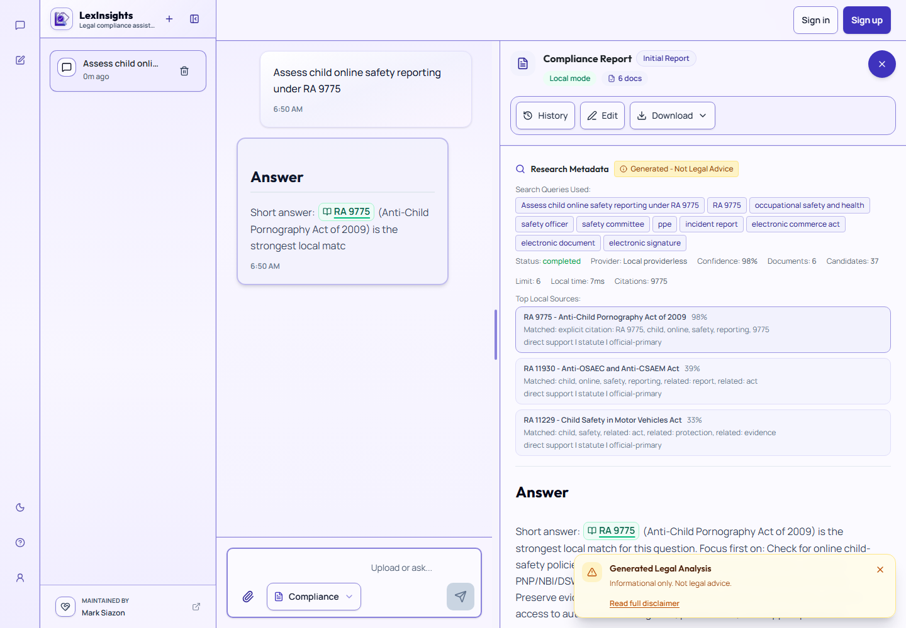

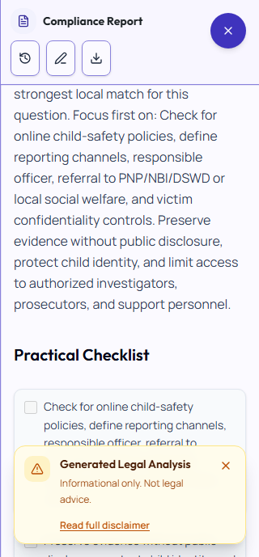

Available captures: [desktop dark](../public/screenshots/A12-Compliance-Report/desktop-dark.png), [desktop light](../public/screenshots/A12-Compliance-Report/desktop-light.png), [mobile 320 light](../public/screenshots/A12-Compliance-Report/mobile-320-light.png), [mobile 320 light scrolled](../public/screenshots/A12-Compliance-Report/mobile-320-light-scrolled.png), [mobile 360 light](../public/screenshots/A12-Compliance-Report/mobile-360-light.png), [mobile 360 light scrolled](../public/screenshots/A12-Compliance-Report/mobile-360-light-scrolled.png), [mobile 364 light](../public/screenshots/A12-Compliance-Report/mobile-364-light.png), [mobile 364 light scrolled](../public/screenshots/A12-Compliance-Report/mobile-364-light-scrolled.png), [mobile 390 dark](../public/screenshots/A12-Compliance-Report/mobile-390-dark.png), [mobile 390 dark scrolled](../public/screenshots/A12-Compliance-Report/mobile-390-dark-scrolled.png).

## Mockup Boards

These composed boards present the screenshot archive as polished showcase material while preserving the real captured interface states.

### A1 - Device Showcase

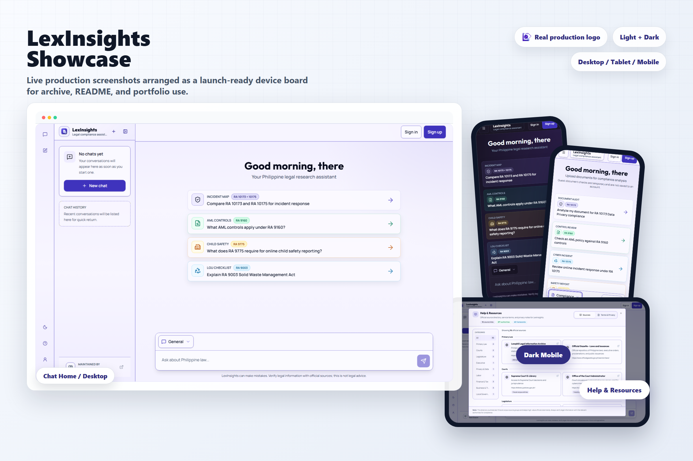

Focus: cross-device presentation for the public chat and compliance experience.

### A2 - Feature Gallery

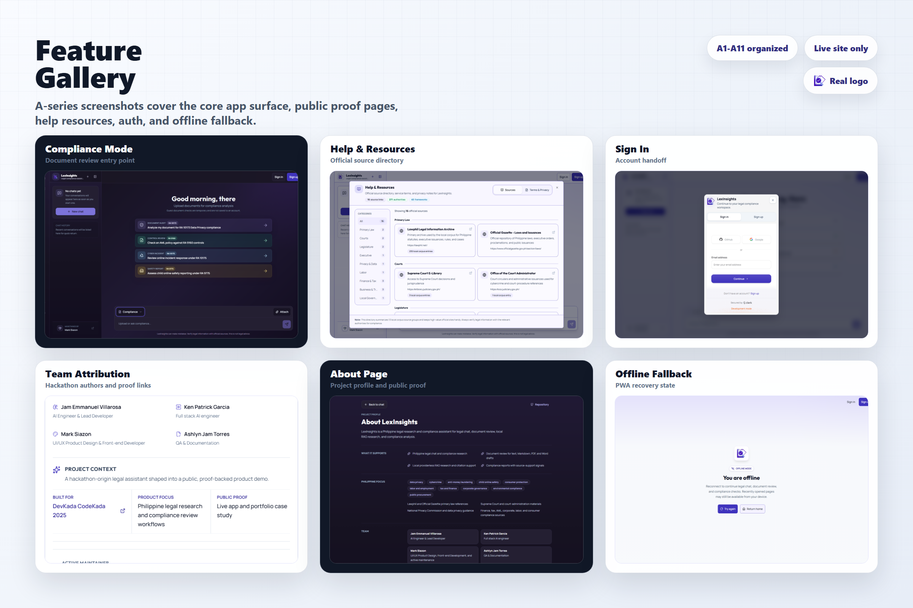

Focus: feature-by-feature overview for archive and reviewer scanning.

### A3 - Theme And Viewport Matrix

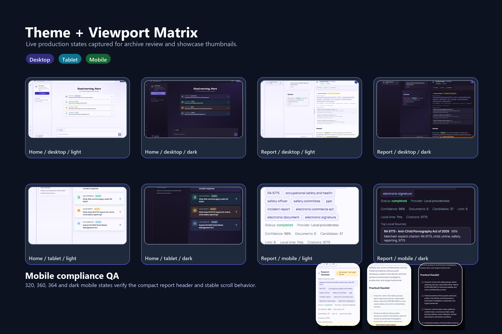

Focus: light and dark theme coverage across the captured responsive states.

